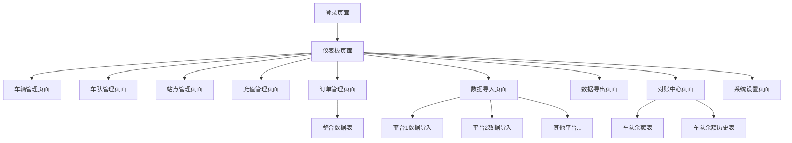

# 数据整合平台 - 产品需求文档

## 1. 产品概述

数据整合平台是一个企业级的数据管理系统，主要用于整合11个外部平台的数据，提供统一的数据管理、处理和结算功能。
- 解决多平台数据格式不统一的问题，通过自动化脚本实现数据标准化处理，为企业提供统一的数据视图和管理界面。
- 目标用户为企业数据管理人员和财务结算人员，帮助提高数据处理效率和结算准确性。

## 2. 核心功能

### 2.1 用户角色

| 角色 | 注册方式 | 核心权限 |
|------|----------|----------|
| 管理员 | 系统预设账号 | 拥有所有功能权限，包括用户管理、系统配置等 |
| 数据操作员 | 管理员创建账号 | 可进行数据导入、查询、修改等日常操作 |
| 财务人员 | 管理员创建账号 | 主要负责对账中心、结算和账单导出功能 |

### 2.2 功能模块

我们的数据整合平台包含以下主要页面：

1. **登录页面**：用户身份验证，会话管理
2. **仪表板页面**：系统概览，快速导航，数据统计展示
3. **车辆管理页面**：车辆信息的增删改查，分页显示，条件搜索
4. **车队管理页面**：车队信息管理，计价规则配置，优惠规则设置
5. **站点管理页面**：充电站点信息管理，站点状态监控
6. **充值管理页面**：充值数据导入，充值记录查询和管理
7. **订单管理页面**：11个平台的订单数据导入，数据整合处理，原始数据保留
8. **数据导入页面**：多平台数据导入脚本，数据格式转换，结算金额计算
9. **数据导出页面**：按条件查询导出，支持多种格式导出
10. **对账中心页面**：车队余额管理，月度结算，账单生成和导出
11. **系统设置页面**：用户管理，系统参数配置，导入规则配置

### 2.3 页面详情

| 页面名称 | 模块名称 | 功能描述 |
|----------|----------|----------|
| 登录页面 | 用户认证 | 用户登录验证，会话管理，密码重置功能 |
| 仪表板页面 | 数据概览 | 显示系统关键指标，各模块数据统计，快速导航入口 |
| 仪表板页面 | 导航菜单 | 提供各功能模块的快速访问入口 |
| 车辆管理页面 | 车辆列表 | 分页显示车辆信息，支持按车牌号、车队等条件搜索 |
| 车辆管理页面 | 车辆操作 | 添加新车辆，编辑车辆信息，删除车辆记录 |
| 车队管理页面 | 车队列表 | 分页显示车队信息，支持按车队名称、状态等条件搜索 |
| 车队管理页面 | 计价规则 | 配置车队的充电计价规则，支持分时段定价 |
| 车队管理页面 | 优惠规则 | 设置车队优惠政策，折扣规则配置 |
| 站点管理页面 | 站点列表 | 分页显示充电站点信息，支持按地区、状态等条件搜索 |
| 站点管理页面 | 站点操作 | 添加新站点，编辑站点信息，站点状态管理 |
| 充值管理页面 | 数据导入 | 支持Excel文件导入充值数据，数据格式验证 |
| 充值管理页面 | 充值查询 | 按时间、车队、金额等条件查询充值记录 |
| 订单管理页面 | 平台数据导入 | 为11个平台分别提供数据导入功能，支持不同数据格式 |
| 订单管理页面 | 数据整合 | 将外部平台数据转换为统一格式，计算结算金额 |
| 订单管理页面 | 原始数据管理 | 保留各平台原始数据，支持查询和修改 |
| 数据导入页面 | 导入脚本 | 为不同平台配置专用的数据导入脚本 |
| 数据导入页面 | 规则配置 | 配置结算金额计算规则，数据验证规则 |
| 数据导出页面 | 条件查询 | 支持多条件组合查询，时间范围筛选 |
| 数据导出页面 | 导出功能 | 支持Excel、CSV格式导出，自定义导出字段 |
| 对账中心页面 | 车队余额 | 显示各车队的上期余额、本月消费、充值、本期余额 |
| 对账中心页面 | 月度结算 | 执行月度结算操作，生成历史记录 |
| 对账中心页面 | 账单导出 | 生成并导出各车队的详细对账单 |
| 系统设置页面 | 用户管理 | 用户账号的创建、编辑、删除和权限分配 |
| 系统设置页面 | 系统配置 | 系统参数设置，数据库连接配置 |

## 3. 核心流程

**管理员流程：**
管理员登录系统后，可以访问所有功能模块。主要操作流程包括：用户管理 → 系统配置 → 数据导入规则配置 → 监控各模块数据处理情况。

**数据操作员流程：**
数据操作员主要负责日常的数据处理工作：登录 → 数据导入（选择平台 → 上传文件 → 执行导入脚本 → 验证数据）→ 数据管理（车辆/车队/站点管理）→ 数据导出。

**财务人员流程：**
财务人员主要使用对账和结算功能：登录 → 对账中心 → 查看车队余额 → 执行月度结算 → 导出对账单。

## 4. 用户界面设计

### 4.1 设计风格

- **主色调**：深蓝色(#1890ff)作为主色，浅灰色(#f5f5f5)作为背景色
- **辅助色**：绿色(#52c41a)表示成功状态，红色(#ff4d4f)表示错误状态，橙色(#fa8c16)表示警告
- **按钮样式**：圆角矩形按钮，主要按钮使用主色调，次要按钮使用边框样式
- **字体**：系统默认字体，标题使用16px-20px，正文使用14px，小字使用12px
- **布局风格**：左侧导航栏 + 顶部面包屑导航，主内容区域使用卡片式布局
- **图标风格**：使用简洁的线性图标，统一的图标库(如Ant Design Icons)

### 4.2 页面设计概览

| 页面名称 | 模块名称 | UI元素 |
|----------|----------|--------|
| 登录页面 | 登录表单 | 居中卡片布局，包含用户名/密码输入框，登录按钮，背景使用渐变色 |
| 仪表板页面 | 统计卡片 | 4列网格布局，每个卡片显示关键数据指标，使用图标和数字展示 |
| 仪表板页面 | 导航菜单 | 左侧固定导航栏，深色背景，白色文字，支持折叠展开 |
| 车辆管理页面 | 数据表格 | 带分页的表格组件，表头固定，支持排序，行操作按钮 |
| 车辆管理页面 | 搜索表单 | 顶部搜索栏，多条件筛选，重置和搜索按钮 |
| 车队管理页面 | 规则配置 | 标签页切换，表单输入，实时预览计算结果 |
| 充值管理页面 | 文件上传 | 拖拽上传组件，支持Excel文件，上传进度显示 |
| 订单管理页面 | 平台选择 | 标签页或下拉选择，每个平台独立的数据表格 |
| 数据导出页面 | 查询条件 | 折叠面板布局，多条件组合查询，日期范围选择器 |
| 对账中心页面 | 余额表格 | 突出显示金额字段，使用颜色区分正负值，汇总行 |

### 4.3 响应式设计

系统采用桌面优先的设计策略，主要面向PC端用户使用。在平板设备上进行适配优化，确保1024px以上分辨率的良好显示效果。移动端提供基础的查看功能，复杂的数据操作建议在桌面端进行。