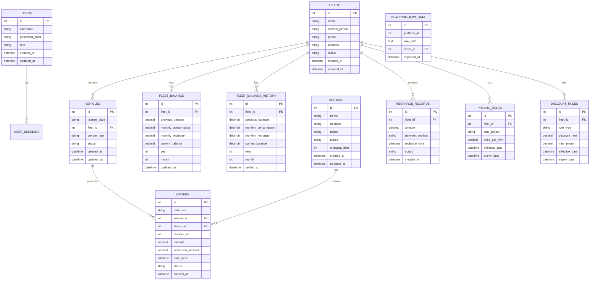

# 数据整合平台 - 技术架构文档

## 1. 架构设计


## 2. 技术描述

* 前端：Vue.js 3 + Element Plus + Axios + Vue Router

* 后端：Flask 2.0 + Flask-SQLAlchemy + Flask-CORS + Flask-JWT-Extended

* 数据库：MySQL 8.0

* 文件处理：pandas + openpyxl

* 部署：前端 Nginx，后端 Gunicorn + Nginx

## 3. 路由定义

### 3.1 前端路由 (Vue Router)

| 路由              | 组件名称           | 用途               |
| --------------- | -------------- | ---------------- |
| /               | Dashboard      | 首页重定向到仪表板        |
| /login          | Login          | 用户登录页面           |
| /dashboard      | Dashboard      | 仪表板页面，显示系统概览和导航  |
| /vehicle        | VehicleManage  | 车辆管理页面，车辆信息的增删改查 |
| /fleet          | FleetManage    | 车队管理页面，车队信息和规则配置 |
| /station        | StationManage  | 站点管理页面，充电站点信息管理  |
| /recharge       | RechargeManage | 充值管理页面，充值数据导入和查询 |
| /order          | OrderManage    | 订单管理页面，多平台订单数据管理 |
| /import         | DataImport     | 数据导入页面，外部平台数据导入  |
| /export         | DataExport     | 数据导出页面，按条件导出数据   |
| /reconciliation | Reconciliation | 对账中心页面，车队余额和结算管理 |
| /settings       | Settings       | 系统设置页面，用户和系统配置   |

### 3.2 后端API路由 (Flask)

| API路由                          | 方法     | 用途      |
| ------------------------------ | ------ | ------- |
| /api/auth/login                | POST   | 用户登录认证  |
| /api/auth/logout               | POST   | 用户登出    |
| /api/auth/refresh              | POST   | 刷新JWT令牌 |
| /api/vehicles                  | GET    | 获取车辆列表  |
| /api/vehicles                  | POST   | 创建新车辆   |
| /api/vehicles/{id}             | PUT    | 更新车辆信息  |
| /api/vehicles/{id}             | DELETE | 删除车辆    |
| /api/fleets                    | GET    | 获取车队列表  |
| /api/fleets                    | POST   | 创建新车队   |
| /api/fleets/{id}               | PUT    | 更新车队信息  |
| /api/fleets/{id}               | DELETE | 删除车队    |
| /api/stations                  | GET    | 获取站点列表  |
| /api/stations                  | POST   | 创建新站点   |
| /api/stations/{id}             | PUT    | 更新站点信息  |
| /api/stations/{id}             | DELETE | 删除站点    |
| /api/recharge                  | GET    | 获取充值记录  |
| /api/recharge/import           | POST   | 导入充值数据  |
| /api/orders                    | GET    | 获取订单列表  |
| /api/orders/import             | POST   | 导入订单数据  |
| /api/export/data               | POST   | 导出数据    |
| /api/reconciliation/balance    | GET    | 获取车队余额  |
| /api/reconciliation/settlement | POST   | 执行月度结算  |

## 4. API定义

### 4.1 核心API

**用户认证相关**

```
POST /api/auth/login
```

请求参数：

| 参数名      | 参数类型   | 是否必需 | 描述  |
| -------- | ------ | ---- | --- |
| username | string | true | 用户名 |
| password | string | true | 密码  |

响应参数：

| 参数名            | 参数类型    | 描述      |
| -------------- | ------- | ------- |
| success        | boolean | 登录是否成功  |
| message        | string  | 响应消息    |
| access\_token  | string  | JWT访问令牌 |
| refresh\_token | string  | JWT刷新令牌 |
| user           | object  | 用户信息对象  |

```
POST /api/auth/refresh
```

请求参数：

| 参数名            | 参数类型   | 是否必需 | 描述      |
| -------------- | ------ | ---- | ------- |
| refresh\_token | string | true | JWT刷新令牌 |

响应参数：

| 参数名           | 参数类型    | 描述     |
| ------------- | ------- | ------ |
| success       | boolean | 刷新是否成功 |
| access\_token | string  | 新的访问令牌 |

**数据导入相关**

```
POST /api/import/platform/{platform_id}
```

请求参数：

| 参数名          | 参数类型    | 是否必需 | 描述          |
| ------------ | ------- | ---- | ----------- |
| file         | file    | true | 上传的数据文件     |
| platform\_id | integer | true | 平台ID (1-11) |

响应参数：

| 参数名             | 参数类型    | 描述       |
| --------------- | ------- | -------- |
| success         | boolean | 导入是否成功   |
| imported\_count | integer | 成功导入的记录数 |
| error\_count    | integer | 错误记录数    |
| errors          | array   | 错误详情列表   |

**数据导出相关**

```
POST /api/export/data
```

请求参数：

| 参数名         | 参数类型   | 是否必需  | 描述               |
| ----------- | ------ | ----- | ---------------- |
| table\_name | string | true  | 要导出的表名           |
| conditions  | object | false | 查询条件             |
| format      | string | false | 导出格式 (excel/csv) |

响应参数：

| 参数名           | 参数类型    | 描述       |
| ------------- | ------- | -------- |
| success       | boolean | 导出是否成功   |
| file\_url     | string  | 下载文件的URL |
| record\_count | integer | 导出记录数    |

**月度结算相关**

```
POST /api/reconciliation/monthly-settlement
```

请求参数：

| 参数名   | 参数类型    | 是否必需 | 描述   |
| ----- | ------- | ---- | ---- |
| year  | integer | true | 结算年份 |
| month | integer | true | 结算月份 |

响应参数：

| 参数名               | 参数类型    | 描述      |
| ----------------- | ------- | ------- |
| success           | boolean | 结算是否成功  |
| processed\_fleets | integer | 处理的车队数量 |
| total\_amount     | decimal | 结算总金额   |

## 5. 服务器架构图


## 6. 数据模型

### 6.1 数据模型定义



### 6.2 数据定义语言

**用户表 (users)**

```sql
-- 创建用户表
CREATE TABLE users (
    id INT AUTO_INCREMENT PRIMARY KEY,
    username VARCHAR(50) UNIQUE NOT NULL,
    password_hash VARCHAR(255) NOT NULL,
    role ENUM('admin', 'operator', 'finance') DEFAULT 'operator',
    created_at TIMESTAMP DEFAULT CURRENT_TIMESTAMP,
    updated_at TIMESTAMP DEFAULT CURRENT_TIMESTAMP ON UPDATE CURRENT_TIMESTAMP
);

-- 创建索引
CREATE INDEX idx_users_username ON users(username);
CREATE INDEX idx_users_role ON users(role);

-- 初始化数据
INSERT INTO users (username, password_hash, role) VALUES 
('admin', 'pbkdf2:sha256:260000$salt$hash', 'admin'),
('operator1', 'pbkdf2:sha256:260000$salt$hash', 'operator'),
('finance1', 'pbkdf2:sha256:260000$salt$hash', 'finance');
```

**车队表 (fleets)**

```sql
-- 创建车队表
CREATE TABLE fleets (
    id INT AUTO_INCREMENT PRIMARY KEY,
    name VARCHAR(100) NOT NULL,
    contact_person VARCHAR(50),
    phone VARCHAR(20),
    address TEXT,
    status ENUM('active', 'inactive') DEFAULT 'active',
    created_at TIMESTAMP DEFAULT CURRENT_TIMESTAMP,
    updated_at TIMESTAMP DEFAULT CURRENT_TIMESTAMP ON UPDATE CURRENT_TIMESTAMP
);

-- 创建索引
CREATE INDEX idx_fleets_name ON fleets(name);
CREATE INDEX idx_fleets_status ON fleets(status);
```

**车辆表 (vehicles)**

```sql
-- 创建车辆表
CREATE TABLE vehicles (
    id INT AUTO_INCREMENT PRIMARY KEY,
    license_plate VARCHAR(20) UNIQUE NOT NULL,
    fleet_id INT,
    vehicle_type VARCHAR(50),
    status ENUM('active', 'inactive', 'maintenance') DEFAULT 'active',
    created_at TIMESTAMP DEFAULT CURRENT_TIMESTAMP,
    updated_at TIMESTAMP DEFAULT CURRENT_TIMESTAMP ON UPDATE CURRENT_TIMESTAMP,
    FOREIGN KEY (fleet_id) REFERENCES fleets(id)
);

-- 创建索引
CREATE INDEX idx_vehicles_license_plate ON vehicles(license_plate);
CREATE INDEX idx_vehicles_fleet_id ON vehicles(fleet_id);
CREATE INDEX idx_vehicles_status ON vehicles(status);
```

**订单表 (orders)**

```sql
-- 创建订单表
CREATE TABLE orders (
    id INT AUTO_INCREMENT PRIMARY KEY,
    order_no VARCHAR(50) UNIQUE NOT NULL,
    vehicle_id INT,
    station_id INT,
    platform_id INT NOT NULL,
    amount DECIMAL(10,2) NOT NULL,
    settlement_amount DECIMAL(10,2),
    order_time TIMESTAMP NOT NULL,
    status ENUM('pending', 'completed', 'cancelled') DEFAULT 'pending',
    created_at TIMESTAMP DEFAULT CURRENT_TIMESTAMP,
    FOREIGN KEY (vehicle_id) REFERENCES vehicles(id),
    FOREIGN KEY (station_id) REFERENCES stations(id)
);

-- 创建索引
CREATE INDEX idx_orders_order_no ON orders(order_no);
CREATE INDEX idx_orders_vehicle_id ON orders(vehicle_id);
CREATE INDEX idx_orders_platform_id ON orders(platform_id);
CREATE INDEX idx_orders_order_time ON orders(order_time);
```

**车队余额表 (fleet\_balance)**

```sql
-- 创建车队余额表
CREATE TABLE fleet_balance (
    id INT AUTO_INCREMENT PRIMARY KEY,
    fleet_id INT NOT NULL,
    previous_balance DECIMAL(12,2) DEFAULT 0.00,
    monthly_consumption DECIMAL(12,2) DEFAULT 0.00,
    monthly_recharge DECIMAL(12,2) DEFAULT 0.00,
    current_balance DECIMAL(12,2) DEFAULT 0.00,
    year INT NOT NULL,
    month INT NOT NULL,
    updated_at TIMESTAMP DEFAULT CURRENT_TIMESTAMP ON UPDATE CURRENT_TIMESTAMP,
    FOREIGN KEY (fleet_id) REFERENCES fleets(id),
    UNIQUE KEY uk_fleet_year_month (fleet_id, year, month)
);

-- 创建索引
CREATE INDEX idx_fleet_balance_fleet_id ON fleet_balance(fleet_id);
CREATE INDEX idx_fleet_balance_year_month ON fleet_balance(year
```

