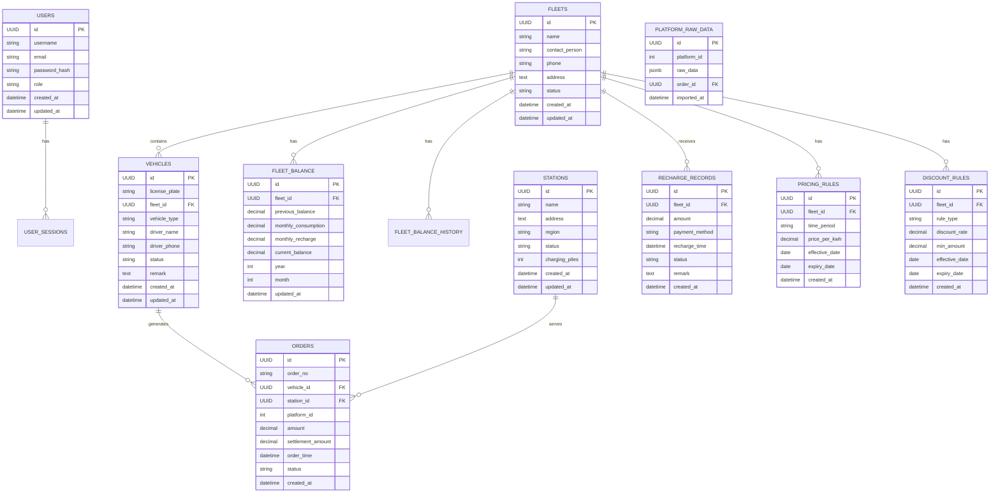

# 数据整合平台项目分析报告

## 1. 项目概述

数据整合平台是一个企业级的前后端分离项目，旨在整合11个外部充电平台的数据，提供统一的数据管理、处理和结算功能。项目采用现代化的技术栈，包括Vue 3 + TypeScript前端和Flask后端，数据库设计完善，具有良好的扩展性和可维护性。

## 2. 技术架构分析

### 2.1 整体架构

项目采用前后端分离架构，具有清晰的层次划分：

### 2.2 技术栈评估

**前端技术栈：**
- Vue 3 + TypeScript：现代化的前端框架，提供类型安全和组件化开发
- Element Plus：成熟的UI组件库，提供一致的用户体验
- Vue Router：官方路由管理器，支持路由守卫和懒加载
- Pinia：新一代状态管理库，轻量且易于使用
- Axios：HTTP客户端，处理API请求
- Vite：快速的构建工具，提供热更新和优化

**后端技术栈：**
- Flask 2.0：轻量级Web框架，灵活且易于扩展
- SQLAlchemy：ORM框架，提供对象关系映射
- Flask-JWT-Extended：JWT认证扩展，处理用户认证
- Flask-CORS：处理跨域请求
- Pandas + OpenPyXL：数据处理和Excel文件处理
- Supabase：提供额外的数据库和实时功能支持

**数据库：**
- PostgreSQL：生产环境数据库，支持复杂查询和事务
- SQLite：开发环境数据库，便于快速开发和测试

## 3. 前端实现状态评估

### 3.1 已实现功能

**完全实现：**
- 登录页面：用户认证功能完整，包括登录表单和状态管理
- 仪表板页面：数据统计卡片、最近订单表格、平台数据统计展示
- 车辆管理页面：完整的CRUD操作，包括列表展示、搜索、分页、新增、编辑、删除功能
- 路由管理：完整的路由配置和路由守卫，支持权限控制
- 用户状态管理：使用Pinia进行用户状态管理，包括登录、登出、用户信息获取

**部分实现：**
- 布局组件：主布局已实现，但部分子功能未完成

### 3.2 未实现功能

**仅占位页面：**
- 车队管理页面：仅有占位内容，未实现具体功能
- 站点管理页面：仅有占位内容，未实现具体功能
- 充值管理页面：仅有占位内容，未实现具体功能
- 订单管理页面：仅有占位内容，未实现具体功能
- 对账中心页面：仅有占位内容，未实现具体功能
- 数据导入页面：仅有占位内容，未实现具体功能
- 数据导出页面：路由配置中缺失

### 3.3 前端代码质量评估

**优点：**
- 代码结构清晰，组件化设计合理
- 使用TypeScript提供类型安全
- 遵循Vue 3组合式API最佳实践
- UI设计美观，用户体验良好
- 错误处理和加载状态管理完善

**不足：**
- 大部分页面功能未实现，仅有占位内容
- 缺少数据导出页面的路由配置
- 部分组件与后端API对接不完整
- 缺少单元测试和端到端测试

## 4. 后端实现状态评估

### 4.1 已实现功能

**完全实现：**
- 用户认证：JWT登录、令牌刷新、用户信息获取
- 车辆管理API：车辆列表查询、创建新车辆
- 车队管理API：车队列表查询
- 数据库模型：用户、车队、车辆模型定义
- 数据库初始化：默认用户和车队数据创建

### 4.2 未实现功能

**缺失API：**
- 站点管理相关API
- 充值管理相关API
- 订单管理相关API
- 数据导入相关API
- 数据导出相关API
- 对账中心相关API
- 车辆编辑和删除API
- 车队编辑和删除API
- 站点CRUD操作API
- 计价规则和优惠规则API

### 4.3 后端代码质量评估

**优点：**
- API设计符合RESTful规范
- 使用JWT进行身份验证，安全性良好
- 错误处理机制完善
- 数据库模型设计合理
- 代码结构清晰，易于扩展

**不足：**
- 大部分API未实现，功能不完整
- 缺少API文档（如Swagger）
- 缺少数据验证和输入过滤
- 缺少日志记录和监控
- 缺少单元测试和集成测试
- 缺少异步任务处理（如Celery）

## 5. 数据库设计评估

### 5.1 数据库架构

数据库设计完善，包含以下主要表：

### 5.2 数据库设计优点

- 使用UUID作为主键，避免ID冲突
- 完整的表关系设计，支持复杂业务逻辑
- 合理的索引设计，提高查询性能
- 使用触发器自动更新时间戳
- 行级安全策略(RLS)增强数据安全性
- 完善的约束和检查，确保数据完整性
- 支持多平台数据整合，保留原始数据

### 5.3 数据库设计不足

- 缺少分区表设计，可能影响大数据量性能
- 缺少全文搜索索引，不支持复杂文本搜索
- 缺少数据归档策略，长期运行可能导致数据膨胀
- 缺少数据库备份和恢复策略文档

## 6. 项目优势与不足

### 6.1 项目优势

1. **技术选型先进**：采用Vue 3 + TypeScript和Flask等现代化技术栈，具有良好的开发体验和性能
2. **架构设计合理**：前后端分离架构，层次清晰，易于维护和扩展
3. **数据库设计完善**：完整的数据模型设计，支持复杂业务逻辑和数据关系
4. **用户体验良好**：前端UI设计美观，交互流畅，符合现代Web应用标准
5. **安全性考虑**：JWT认证、行级安全策略等安全措施到位
6. **文档齐全**：项目包含详细的产品需求文档和技术架构文档

### 6.2 项目不足

1. **功能实现不完整**：大部分核心功能仅实现基础部分或仅有占位页面
2. **API覆盖不全**：后端API实现不完整，无法支撑全部业务功能
3. **测试覆盖不足**：缺少单元测试、集成测试和端到端测试
4. **监控和日志缺失**：缺少系统监控、日志记录和错误追踪
5. **性能优化不足**：缺少缓存机制、查询优化和性能监控
6. **部署配置不完整**：缺少完整的生产环境部署配置和CI/CD流程

## 7. 改进建议和后续开发计划

### 7.1 短期目标（1-2个月）

1. **完善核心功能实现**
   - 实现车队管理页面的CRUD功能
   - 实现站点管理页面的CRUD功能
   - 实现订单管理页面的基础功能
   - 实现充值管理页面的基础功能

2. **完善后端API**
   - 补充缺失的CRUD操作API
   - 实现数据导入和导出API
   - 实现对账中心相关API
   - 实现计价规则和优惠规则API

3. **前后端对接**
   - 完成前端页面与后端API的对接
   - 实现数据绑定和状态同步
   - 完善错误处理和用户反馈

### 7.2 中期目标（3-6个月）

1. **核心业务功能实现**
   - 实现多平台数据导入功能
   - 实现数据整合和转换逻辑
   - 实现结算金额计算
   - 实现车队余额管理
   - 实现月度结算功能

2. **系统优化**
   - 添加缓存机制（Redis）
   - 优化数据库查询性能
   - 实现异步任务处理（Celery）
   - 添加日志记录和监控

3. **测试和质量保证**
   - 编写单元测试
   - 实现集成测试
   - 添加端到端测试
   - 代码质量检查和优化

### 7.3 长期目标（6个月以上）

1. **高级功能实现**
   - 实现数据分析和报表功能
   - 添加实时数据同步
   - 实现自动化数据导入
   - 添加用户权限细粒度控制

2. **系统扩展和优化**
   - 微服务架构重构
   - 容器化部署（Docker）
   - 云服务集成
   - 高可用性和负载均衡

3. **运维和监控**
   - 完善CI/CD流程
   - 添加系统监控和告警
   - 实现自动化备份和恢复
   - 性能优化和容量规划

## 8. 总结

数据整合平台项目具有良好的技术架构和数据库设计，前端用户体验优秀，但功能实现不完整，大部分核心功能仍需开发。项目具有很大的发展潜力，通过按照建议的开发计划逐步完善功能，可以成为一个强大的企业级数据管理平台。

项目的成功关键在于：
1. 优先完成核心业务功能的实现
2. 确保前后端无缝对接和数据一致性
3. 重视系统性能和安全性
4. 完善测试和质量保证流程
5. 持续优化用户体验和系统功能

通过合理的规划和执行，这个项目能够有效解决多平台数据整合的问题，为企业提供统一的数据管理和结算解决方案。